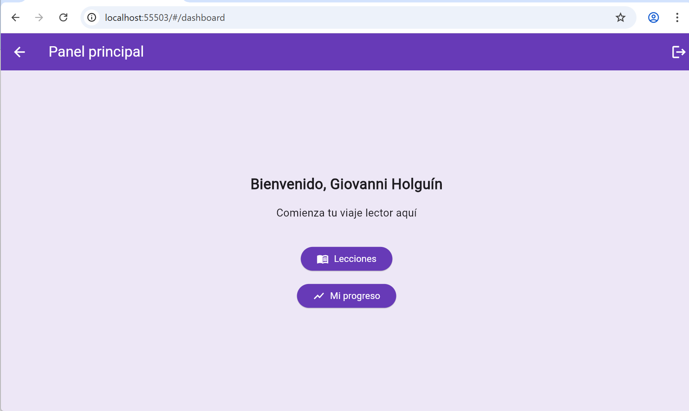

## inicio parte 1: Header and general description

# 📚 Lector Global


📄 This file is in English.  
🌐 [Ver este README en español](README.md)

<p align="center">
  
</p>

<p align="center">
  
</p>

**Lector Global** is a cross-platform educational application (Android, Web, and Windows) developed in Flutter.  
It is designed to enhance reading comprehension in all languages and levels, offering an accessible interface, email verification, and professional user flows.  
Inspired by the principles of the Common European Framework of Reference for Languages (CEFR), this app is ideal for individual learners, schools, and autonomous learning projects.

## fin parte 1
## inicio parte 2: Implemented features and project philosophy

---

## ✅ Implemented Features

| Feature                                | Status     |
| -------------------------------------- | ---------- |
| Email and password registration        | ✅ Complete |
| Email verification                     | ✅ Complete |
| Secure login                           | ✅ Complete |
| Google Sign-In                         | ✅ Complete |
| Password recovery                      | ✅ Complete |
| Real-time language switching           | ✅ Complete |
| Screen reader accessibility            | ✅ Complete |
| Visual form validation                 | ✅ Complete |
| Session control and secure redirection | ✅ Complete |
| Support for Android, Web, and Windows  | ✅ Complete |

---

## 🧭 Project Philosophy

- 📖 **Reading to transform**: Reading comprehension is the gateway to critical thinking and social transformation.
- 🌎 **Global from the start**: From the first screen, Lector Global is multilingual, accessible, and inclusive.
- 🛡️ **Real security**: Robust authentication, email verification, and protection against fake accounts.
- 🧱 **Professional architecture**: Modular, scalable, and maintainable by any development team.
- 🧩 **Interoperability**: Compatible with Android, Web, and Windows from a single codebase.

## fin parte 2
## inicio parte 3: Installation instructions and project structure

---

## 🚀 Installation Instructions

Clone the repository and run the project on your preferred platform:

```bash
git clone https://github.com/giovannihr2004/lg2.git 
cd lg2
flutter pub get
flutter run -d chrome     # For Web
flutter run -d windows    # For Windows
flutter run -d <device_id>  # For a physical or emulated Android device
```

---

## 🗂️ Project Structure

```bash
lib/
├── main.dart                         # Main entry point
│
├── screens/                          # Screens grouped by flow
│   ├── auth/                         # Registration, login, password recovery
│   ├── splash/                       # Animated splash screens
│   ├── intro/                        # Welcome and language selection screen
│   └── dashboard/                    # Main user dashboard
│
├── services/                         # Decoupled business logic (Firebase, Google Sign-In, etc.)
├── providers/                        # Global state (language, session, theme)
├── widgets/                          # Reusable visual components
├── l10n/                             # Localization files (.arb)
├── assets/                           # Images, icons, logos
└── generated/                        # Files autogenerated by Flutter
```

## fin parte 3
## inicio parte 4: Authentication and accessibility

---

## 🔐 Authentication and Security

Lector Global uses Firebase Authentication with email/password and Google Sign-In.  
Access to the app is restricted until the user's email address has been verified, ensuring greater security and control.

- ✅ Visual password validation (minimum 8 characters, including uppercase, lowercase, number, and symbol)
- ✅ Complete password recovery flow
- ✅ Login only allowed if the email is verified
- ✅ Google Sign-In available on Web and Android
- ✅ Session protection using `user.reload()` and conditional logic

---

## ♿ Integrated Accessibility

- Use of the `Semantics` widget to support screen readers
- Keyboard navigation enabled with `FocusNode` for forms and buttons
- High-contrast colors and legible typography for users with visual impairments
- Real-time translation support for up to 10 languages

## fin parte 4
## inicio parte 5: License, author, and contributions

---

## 📝 License

**Lector Global** is an educational and social project, open to collaboration.  
Its code may be freely reused for **educational and non-commercial** purposes.  
Commercial use is not allowed without the author's explicit permission.

---

## 👤 Author

**Giovanni Holguín Rojas**  
📍 Medellín, Colombia  
👨‍🏫 Teacher, researcher, and educational software developer  
📬 Contact: [giovannihr2004@gmail.com](mailto:giovannihr2004@gmail.com)  
🔗 [Official GitHub Repository](https://github.com/giovannihr2004/lg2)

---

## 🤝 Contributions

Interested in contributing to the project? You're welcome!

```bash
# 1. Fork the repository
# 2. Create a new branch: git checkout -b feature/my-feature
# 3. Make your changes and push: git push origin feature/my-feature
# 4. Open a Pull Request on GitHub
```

## fin parte 5
## inicio parte 6: Optional improvements status

---

## ✅ Optional Improvements Status

| Optional Improvement          | Status     | Details                                                             |
| ----------------------------- | ---------- | ------------------------------------------------------------------- |
| 📷 Screenshot or GIF           | ✅ Complete | Real image inserted: `assets/images/dashboard_demo.png`             |
| 🌐 Online demo link            | ❌ Pending  | No deployment yet on Firebase Hosting or GitHub Pages               |
| 🏷️ Informative badges          | ✅ Complete | Flutter, Firebase, Platform, and License badges correctly displayed |
| ✅ Feature table               | ✅ Complete | Feature table with 10 fully implemented and verified items          |
| 🌍 Full English README version | ✅ Complete | This `README.en.md` is the full English version                     |

---

## fin parte 6
 
