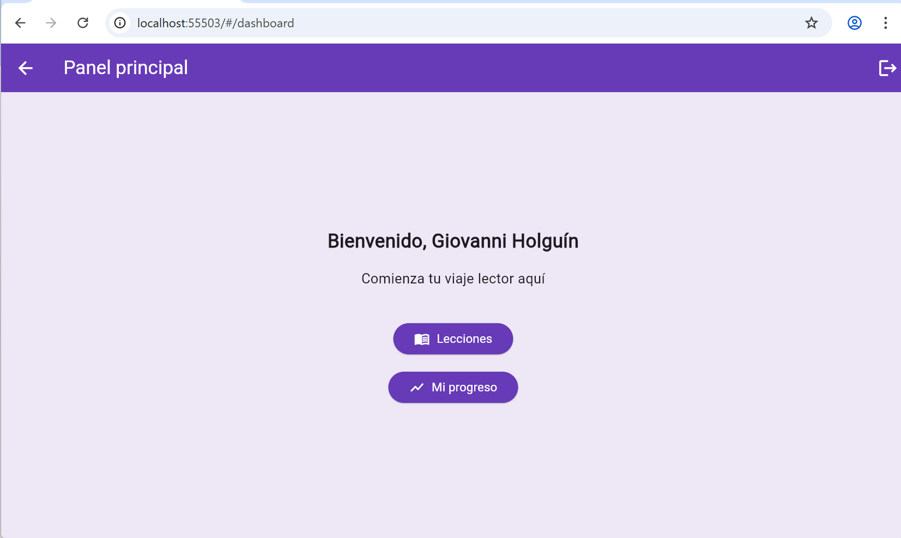

## inicio parte 1: Encabezado y descripción general

# 📚 Lector Global


📄 Este archivo está en español.  
🌐 [View this README in English](README.en.md)

<p align="center">
  
</p>

<p align="center">
  
</p>

**Lector Global** es una aplicación educativa multiplataforma (Android, Web y Windows) desarrollada en Flutter.  
Está diseñada para fortalecer la comprensión lectora en todos los idiomas y niveles, con una interfaz accesible, validación por correo electrónico y flujos de usuario profesionales.  
Inspirada en los principios del Marco Común Europeo de Referencia para las Lenguas (MCER), esta app es ideal para usuarios individuales, instituciones educativas y proyectos de aprendizaje autónomo.

## fin parte 1
## inicio parte 2: Funcionalidades implementadas y filosofía del proyecto

---

## ✅ Funcionalidades implementadas

| Funcionalidad                             | Estado     |
| ----------------------------------------- | ---------- |
| Registro con correo y contraseña          | ✅ Completo |
| Verificación de correo electrónico        | ✅ Completo |
| Inicio de sesión con validación segura    | ✅ Completo |
| Inicio de sesión con Google               | ✅ Completo |
| Recuperación de contraseña                | ✅ Completo |
| Cambios de idioma en tiempo real          | ✅ Completo |
| Accesibilidad para lectores de pantalla   | ✅ Completo |
| Validación visual de formularios          | ✅ Completo |
| Control de sesión y redirección segura    | ✅ Completo |
| Compatibilidad con Android, Web y Windows | ✅ Completo |

---

## 🧭 Filosofía del proyecto

- 📖 **Lectura para transformar**: la comprensión lectora es la puerta de entrada al pensamiento crítico y a la transformación social.
- 🌎 **Global desde el inicio**: desde la primera pantalla, Lector Global es multilingüe, accesible e inclusivo.
- 🛡️ **Seguridad real**: autenticación sólida, validación de correo y protección contra cuentas falsas.
- 🧱 **Arquitectura profesional**: modular, escalable y mantenible por cualquier equipo de desarrollo.
- 🧩 **Interoperabilidad**: compatible con Android, Web y Windows desde una misma base de código.

## fin parte 2
## inicio parte 3: Instrucciones de instalación y estructura del proyecto

---

## 🚀 Instrucciones de instalación

Clona el repositorio y ejecuta el proyecto en tu plataforma preferida:

```bash
git clone https://github.com/giovannihr2004/lg2.git 
cd lg2
flutter pub get
flutter run -d chrome     # Para Web
flutter run -d windows    # Para Windows
flutter run -d <device_id>  # Para dispositivo Android físico o emulador
```

---

## 🗂️ Estructura del proyecto

```bash
lib/
├── main.dart                         # Punto de entrada principal
│
├── screens/                          # Pantallas agrupadas por flujo
│   ├── auth/                         # Registro, login, recuperación
│   ├── splash/                       # Pantallas splash animadas
│   ├── intro/                        # Pantalla de bienvenida y selección de idioma
│   └── dashboard/                    # Panel principal del usuario
│
├── services/                         # Lógica desacoplada (Firebase, Google Sign-In, etc.)
├── providers/                        # Estado global (idioma, sesión, tema)
├── widgets/                          # Componentes visuales reutilizables
├── l10n/                             # Archivos de localización (.arb)
├── assets/                           # Imágenes, íconos, logos
└── generated/                        # Archivos autogenerados por Flutter
```

## fin parte 3
## inicio parte 4: Autenticación y accesibilidad

---

## 🔐 Autenticación y seguridad

Lector Global utiliza Firebase Authentication con correo electrónico, contraseña y Google Sign-In.  
El acceso está restringido hasta que el usuario haya verificado su correo electrónico, garantizando mayor seguridad y control.

- ✅ Validación visual de contraseñas (mínimo 8 caracteres, con mayúsculas, minúsculas, número y símbolo)
- ✅ Flujo completo de recuperación de contraseña
- ✅ Inicio de sesión solo si el correo ha sido verificado
- ✅ Inicio de sesión con Google disponible en Web y Android
- ✅ Protección de sesión con `user.reload()` y validaciones condicionales

---

## ♿ Accesibilidad integrada

- Uso del widget `Semantics` para mejorar la compatibilidad con lectores de pantalla
- Navegación por teclado habilitada con `FocusNode` para formularios y botones
- Colores con alto contraste y tipografía legible para usuarios con dificultades visuales
- Traducción activa y en tiempo real para hasta 10 idiomas

## fin parte 4
## inicio parte 5: Licencia, autor y contribuciones

---

## 📝 Licencia

**Lector Global** es un proyecto educativo y social, abierto a la colaboración.  
Su código puede ser reutilizado libremente con fines **educativos y no comerciales**.  
No se permite su comercialización sin autorización expresa del autor.

---

## 👤 Autor

**Giovanni Holguín Rojas**  
📍 Medellín, Colombia  
👨‍🏫 Docente, investigador y desarrollador de software educativo  
📬 Contacto: [giovannihr2004@gmail.com](mailto:giovannihr2004@gmail.com)  
🔗 [Repositorio oficial en GitHub](https://github.com/giovannihr2004/lg2)

---

## 🤝 Contribuciones

¿Te interesa aportar al proyecto? ¡Eres bienvenido!

```bash
# 1. Haz un fork del repositorio
# 2. Crea una rama con tu mejora: git checkout -b feature/mi-mejora
# 3. Realiza tus cambios y súbelos: git push origin feature/mi-mejora
# 4. Abre un Pull Request desde GitHub
```

## fin parte 5
## inicio parte 6: Estado de mejoras opcionales

---

## ✅ Estado de mejoras opcionales

| Mejora opcional                        | Estado       | Detalle                                                                 |
| ------------------------------------- | ------------ | ----------------------------------------------------------------------- |
| 📷 Captura de pantalla o GIF          | ✅ Completo   | Imagen real insertada: `assets/images/dashboard_demo.png`              |
| 🌐 Enlace a demo en línea             | ❌ Pendiente  | No hay despliegue aún en Firebase Hosting ni GitHub Pages              |
| 🏷️ Badges informativos               | ✅ Completo   | Badges de Flutter, Firebase, Plataforma y Licencia correctamente visibles |
| ✅ Tabla de funcionalidades           | ✅ Completo   | Tabla con 10 funcionalidades implementadas y verificadas                |
| 🌍 Versión completa en inglés         | ✅ En progreso| Disponible en `README.en.md`, sigue en expansión                       |

---

## fin parte 6
